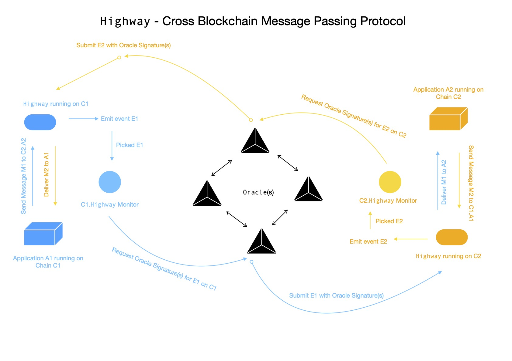
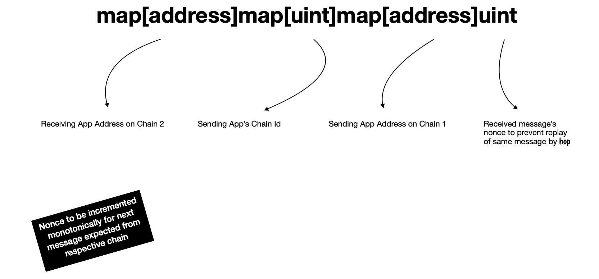
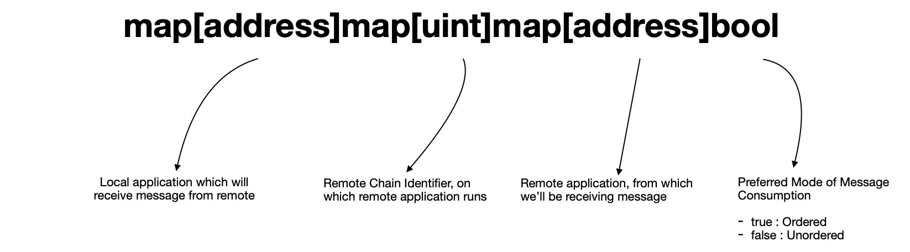
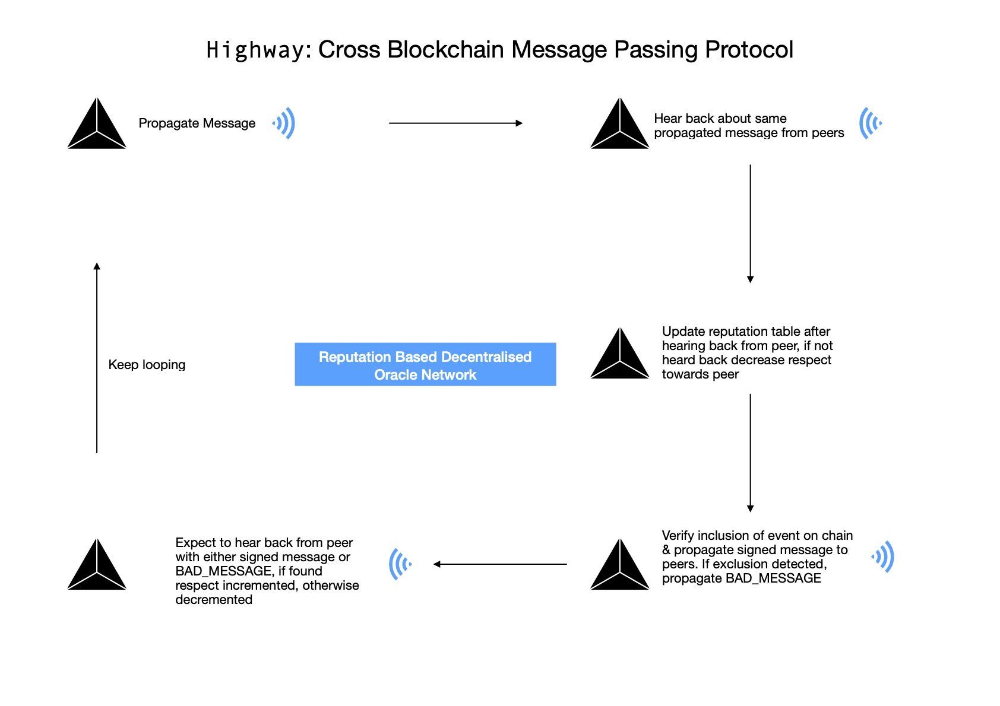

# highway
Cross Blockchain Message Passing Protocol



## Motivation

We're living in a time when new blockchain(s) popping up every single day, due to ease of accessibility to framework(s) for creating chains. We've our assets living on those self-sovereign chains, each using some mechanism for reaching consensus. Some times these assets are not desired to be kept confined on a single chain rather they're intended to be moving across several chains seamlessly.

This project is an attempt in creating a generic protocol for passing arbitrary messages in between applications running on two different chains. Their state can now be shared across multiple chains. I'll propose one design so that dApps running on different chains can talk to their peers over a reliable, (un-)ordered, authenticated, trustless _( **cause the lesser the better** )_ channel.

> One thing I'd like to clear, this project doesn't think any chain as **root chain ( i.e. L1 ) / child chain ( i.e. L2 )**, rather every participating chain is considered to be operating independently.

---

Broadly speaking, we need two components for reliably passing messages between two applications running on two different chains.

- OnChain Entity
- OffChain Entity

Let's expand on each of these.

### OnChain Entity

Let's say application **A1**, **A2** running on chain **C1**, **C2** respectively, wants to talk to each other, below is a proposed flow.

---

**A1** invokes `send(uint chainId, address app, byte[] message, address hop)` method of `Highway` dApp deployed on **C1**, as an effect of user triggered tx **T1**, which will result into emission of event log of below form

```js
Message(uint sourceChainId, address sourceApp, address hop, uint targetChainId, address targetApp, uint nonce, bytes[] message)
```

We also assume, in block **B1** of chain **C1**, tx **T1** is included. How this event log will be captured by **OFFCHAIN** entity ( i.e. `hop` ), we'll see that in sometime.

For emitting event of aforementioned form, we need to hold some state in `Highway` on **C1**.

> Think of `Highway` on **C1** as a gateway to send message to outer world, where some outer world entity ( i.e. `hop` ) will pick it up, get it signed by majority of oracle network & send it to recipient chain's `Highway`, which will attempt to verify it.

For each dApp, on any possible chain _( != **C1** )_, to which any application on **C1** might ever want to send message, we're keeping some state using following data structure


```js
function send(uint chainId, address app, byte[] message, address hop) {

    // -- book keeping, starts
    var sourceChainId = getChainId() // C1's built-in function
    var sourceApp = getSenderAddress() // C1's built-in function
    var targetChainId = chainId
    var targetApp = app
    var nonce = ... // figure it out from state keeper nested associative array
    // -- book keeping done

    emit Message(sourceChainId, sourceApp, hop, targetChainId, targetApp, nonce, message) // voila 🎉

}
```

---

ℹ️ For now, let's assume `hop` picks event log from **C1** _( which has interest in passing this message cross chain )_ & get it signed by majority of oracle network participants. 

⚠️ _They will only sign message, after verifying occurance of event **E1** in transaction **T1** included in block **B1** on chain **C1**._

As long as majority of these oracle network participants are honest & proposal is correct, it'll be signed & propagated back to proposer `hop`. `Highway` on **C2** only consumes message, if it finds majority of valid signatures from decentralised oracle network & it's already aware of who're actual participants of oracle network.

> `Highway` doesn't process same message > 1 times, by checking respective message nonce.

---

Let's now step-by-step go through what happens, when `Highway` on **C2** receives message sent by **A1** of **C1**, in form

```js
function receive(uint sourceChainId, address sourceApp, address hop, uint targetChainId, address targetApp, uint nonce, byte[] message, byte[][] sigs) {

    // ...

}
```

For verifying signatures, it'll first need to construct message which was signed by oracle network.

```js
var oracles = []address // Oracle Network Participant Addresses

function receive(...) {
    var message = serialize({
        sourceChainId,
        sourceApp,
        hop,
        targetChainId,
        targetApp,
        nonce,
        message
    }) // C2's built-in function for serializing object into byte array
    var hashedMessage = hash(message) // C2's built-in function

    var sigCount = 0 // how many are signed by registered oracles
    for(var i = 0; i < len(sigs); i++) {

        var signed = sigs[i]
        if(getSigner(hashedMessage, signed) in oracles) {
            sigCount++
        }

    }

    if(sigCount <= len(oracles) / 2) {
        // > 50% signature verification didn't pass
        return
    }
    // proceed
}
```

> `serialize(...)` is same as what's used by oracle network for serializing parts & signing. **❗️ If not, signature verification won't work. ❗️**

> `hash(...)` is a commonly agreed upon function being used by system for converting large message slice into 32-byte array, which is signed by **Oracle Network**. Primarily I'm using `keccak256`.

It's obvious that receiving side also should keep some state for checking orderliness of messages received from sender. It'll also prevent it from consuming same message twice.

Proposed data structure looks like



If orderliness is tested to be passing, `C2.Highway` will invoke `onReceive` method of **A2** running on **C2**.

```js
function onReceive(uint chainId, address app, byte[] message) {

    // ...
    // A2 ( on C2 ) can now process this message from A1 ( on C1 )
    //
    // These messages are received in ordered, authenticated, verified form

}
```

---

### OffChain Entity

Now we'll define specification for how events emitted by **A1** running on **C1** are caught by **OFFCHAIN** entities & reliably sent to `Highway.receive(...)` running on **C2**, which eventually passes it to **A2**.

---

When a new `Message(...)` event is seen to be emitted from **C1.Highway** designated program i.e. `hop` picks it up, which itself is part of Oracle Network & proposes it to Oracle Network participants for getting it signed. Oracle Network's each participant take independent decision by querying chain **C1**'s transaction **T1** included in block **B1** & checking whether event **E1** is present or not.

If found positive, they'll sign `keccak256`-ed serialised ( yes, deterministic ) form of event **E1** with their private key & publish signed message to their peers over p2p network. Proposer node i.e. designated `hop` collects majority of signatures & goes for submitting message, by passing transaction **T2** on chain **C2**.

---

**⭐️ Now I'm going to propose two models**

- Push Model [ **Ordered Channel** ]
- Pull Model [ **Unordered Channel** ]

Let's talk more about them to understand how are they important for our protocol.

#### Push Model

Till now we've event **E1**'s `keccak256`-ed serialised form signed by majority of Oracle Network participants. Also assuming targetChain i.e. **C2** doesn't have issue of high transaction cost, in that case, **OFFCHAIN** entity which picked event **E1** & got signed by Oracle Network participant, can go on & submit transaction **T2** on chain **C2**.

I call this model **PUSH**-ing.

#### Pull Model

Now assume, target chain **C2** has high transaction cost issue, then it might be a good choice to let user's perform their transaction **T2** on chain **C2**. In this case **OFFCHAIN** entity collects event **E1** from chain **C1** & get it signed by majority of Oracle Network participants. Signed messages & original one is kept in a publicly accessible queue, from where user **U1** can pick it up & submit transaction **T2**. This way you let user carry their charge of cross-chain message passing.

I call this model **PULL**-ing, because user pulls & submits tx.

---

**Modification**

We've to make a small change in our orderliness keeper data structure on `Highway` i.e. we're making a distinction between two kinds of channels.

In **Push Model** all messages passed from **C1 -> C2** are passed in ordered manner by **OFFCHAIN** entity ( `hop` ), which is why **Push Model** uses ordered channel.

But in **Pull Model** users can just send transaction **T2** on chain **C2** with message of their interest. What it essentially results into, message with nonce **1** might arrive before nonce with **0** in `C2.Highway`. In that case `C2.Highway` should drop that message, if it's ordered channel. But if we bring unordered channel into picture, we can allow this kind of message passing.

> Note, none of Ordered/ Unordered channel processes message with same nonce twice.

Structure for keeping message consumption information of unordered channel looks like


---

Whenever a channel is created between application **A1** of chain **C1** & application **A2** of chain **C2**, it needs to be registered with `Highway` application running on respective chains. This will be required when receiving message from other side, for determining _does `Highway` need to respect orderly consumption of messages or it can just accept messages in any order_.

I propose one method on `Highway` on-chain application, which will be used for registering channel between applications.

```js
function registerChannel(address localApp, uint remoteChainId, address remoteApp, bool ordered) {}
```

Invoking this method chain **C1**, helps `C1.Highway` to decide whether it's supposed to be respecting orderliness of messages from **C2.A2**. Same method needs to be invoked on **C2**, for letting `C2.Highway` know what should it do when it sees any message coming from **C1.A1** i.e. does it orderly processes them or let them get marked arbitrarily by nonce to just avoid > 1 time consumption.

**If `Highway` on any chain doesn't find any entry for preferred mode of operation of channel, it must reject those messages, when it's asked to consume those.** 👍

Preferred mode of operation needs to be kept on-chain in structure looking like



---

**Envisioned Setup Steps**

For first time when `Highway` being deployed between chain **C1** & **C2**, there're a few steps which need to be followed

- `C1.Highway` must primarily learn about who're participants of Oracle Network i.e. only majority of whose signed messages it'll be consuming
    - This can be done by invoking one method in `C1.Highway`, where signed messages _( of a pre-agreed message format, by Oracle Network participants )_ needs to be passed. Method signature looks like

    ```js
    var oracles = []address
    var message = []byte("HIGHWAY:${getChainId()}")

    function registerOracles(byte[][] sigs) {

        for(var i = 0; i < len(sigs); i++) {

            var signed = sigs[i]
            var signer = getSigner(message, signed)
            oracles.push(signer)

        }

    }
    ```

    - Preagreed format is of form `HIGHWAY:<C1'S-UNIQUE-CHAIN-ID>`, because every participating chain is expected to have one unique chain id.
    - Appending `chainId` to signed message prevents same signature from being used in multiple chain's `Highway.registerOracles(...)`
    - Completion of this steps implicitly assumes two more things are done ✅
        - At least one participant of oracle network has access to RPC URL of **C1**'s node, for picking events of form `Message(...)` & getting it signed by majority of oracle network [ **This plays role of a hop** ]
        - All oracle network participants must have access to RPC URL of **C2**'s node for verifying inclusion of transaction **T2** in block **B2** of chain **C2**, which emitted event **E2**, that is being transmitted from **C2 -> C1**

        > Yes, it needs to be done explicitly, but I assume it's done.

- Now we're going to perform same set of steps in `C2.Highway`. Make sure you also give all oracle network participants access to RPC URL of **C1**'s node for them to be able verify before signing any message coming from chain **C1**. Also at least one oracle node must have access to **C2**'s RPC URL for picking messages, need to be transported cross-chain.
- We need to think about how many oracle network participants are supposed to be present at beginning. More can be added later.
- Starting with 5 oracle nodes
    - +1 : for picking events from chain **C1** & proposing those to network for signing
    - +1 : same as above, but for chain **C2**
    - +3 : just mere participants, not representative of any chain, simply checks & signs after finding everything **OKAY**
- Let's now think of one scenario
    - Application **A1** of chain **C1** is interested in talking to application **A2** of chain **C2** _( in full duplex manner )_, which is why we created aforementioned setting. So you can think of 2 among those 5 oracle nodes, are kind of respresentative of application **A1** & **A2** ( actually `hop`(s) ). Their interest is keeping this **HIGHWAY** clear between **C1.A1** & **C2.A2**, so that cars carrying message can be passing seamlessly 😅.
    - Remember `Highway` can handle messages to & from any application **Ax** running on any chain **Cx**. Today **C1.A1** might be interested in talking to **A3** of chain **C3** _( yeah full duplex )_ then it should be able to do it very easily. It just requires few additions
        - For consuming messages reliably from chain **C3**, oracle network nodes must learn about RPC URL of **C3**
        - One new node will join oracle network so that it can pick events from on chain **C3** & propose it to oracle network participants, so that it can get it signed by them all.
        > Yes, that's it 🎉
    - After some time, application **A^** of chain **C1** might be interested in talking to chain **C3.A3**, now notice, oracle network nodes already know RPC URL of both participating chains i.e. **C1**, **C3**. So only one new node will join oracle network i.e. representative of **C1.A^** ( actually `hop` node ) for picking events of its interest & getting it signed by oracle network participants, so that it can be sent to **C3.A3**. For messages coming from **C3.A3** there's already one representative of it which takes care of picking messages from event log of **C3.A3** & getting signed by network so that it can be reliably passed to **C1.A^** for consumption.
- This way oracle network can keep growing. One question you're probably asking, 
    - ❓ **Why should a oracle network participant bother itself about signing message coming from some chain/ application which is different that its own ?** Let's find it together.

---

#### Reputation based Decentralised Oracle Network

I propose one reputation based mechanism for aforementioned oracle network to operate in. Let's start by taking a look at one possible setup of `Highway`.

There're 3 independent chains i.e. **C1, C2, C3** & dApp **A1, A2, A3** running on those chains respectively, while following full duplex communication channels have been setup.

- **C1.A1 <-> C2.A2**
- **C1.A1 <-> C3.A3**
- **C2.A2 <-> C3.A3**

There're 6 oracle network participants.

- +1 : Designated event **E1** picker from **C1.Highway** & proposes
- +1 : Designated event **E2** picker from **C2.Highway** & proposes
- +1 : Designated event **E3** picker from **C3.Highway** & proposes
- +3 : Not from any side, just follows protocol

For passing event **E1** of **C1.A1** to **C2.A2**

1) Designated hop of **C1** picks event **E1** & invokes `propagateMessage(...)` routine to send it to all participants of oracle network, who're supposed to be verifying & signing it.
2) On reception of this message, each of recepient oracle nodes will first increment reputation of sender node by 1.

> 🔆 Every node maintains a reputation table, which records how does it see other network participants i.e. how much respectful does it find other peers of it ?

3) After that each of them will invoke `propagateMessage(...)` for propagating to all other network participants.
4) Each of participants now expect to hear back from others with `propagateMessage(...)` call for message **M**. On reception of that expected message they'll update their own view towards other members of network by incrementing respective reputation. If they don't hear back from members _( within a stipulated timeperiod )_, whom it expected to respond back to it, their reputation will be decremented.

> We'll define `stipulated timeperiod`.

5) Now each participant who received & sent `propagateMessage(...)` is going to check inclusion of event **E1** in transaction **T1** in block **B1** of chain **C1**. If it finds included, it'll invoke `propagateSignedMessage(...)` to all other participants. Otherwise it'll invoke special `BAD_MESSAGE(...)` & propagate throughout network.
6) Each of them now expect to hear back from other peers. If they hear back, with correct message, their reputation will be incremented. If not heard back, respective reputation will be decremented.

> `Stipulated timeperiod` : As soon as a message is received from `hop` for first time, it'll be acted on & propagated back to network, after that a timer of **N seconds** started off & expected to hear back from all parties before that timer reaches 0. If not heard, their reputation to be decremented as per rule specified. Same happens in second phase of protocol.

A visual representation of how it works



The mantra is, **Rather than relying on peers to learn how they view world around them, view it from your own perspective with trust on self**.

Reputation of a peer in eye of another either increments or decrements depending upon how they behave during protocol execution. All good peers are going to be behaving well so their reputation will get incremented in eye of other participants. But for bad peers, who are malice, their reputation in eye of good peers will get decrementeed, due to found misalignment in their activities.

Here I present one table on how rewarding with more reputation or slashing by lowering reputation can be done

Step | Followed protocol | Didn't follow protocol
--- | --: | --:
`propagateMessage(...)` | +1 | -1
`propagateSignedMessage(...)` | +1 | -1
`BAD_MESSAGE(...)` | +1 | -1

`hop` who proposes bad message, will be slashed heavily, it's reputation score can be updated using

```js
var reputation = getReputationOfPeer(hop)

if(reputation > 0) {
    reputation = -reputation
} 
else if (reputation == 0) {
    reputation = -100
}
else {
    reputation = 4 * reputation
}
```

When some `hop` proposes one message for getting it signed by network, its reputation to be checked first, if found to be negative, message to be dropped. All good participants to behave that way i.e. bad participant now needs to gain reputation again by behaving well in network & participants to consider its request when they find its reputation score is not anymore **< 0**.

**Specification writing in progress, implementation yet to start**
