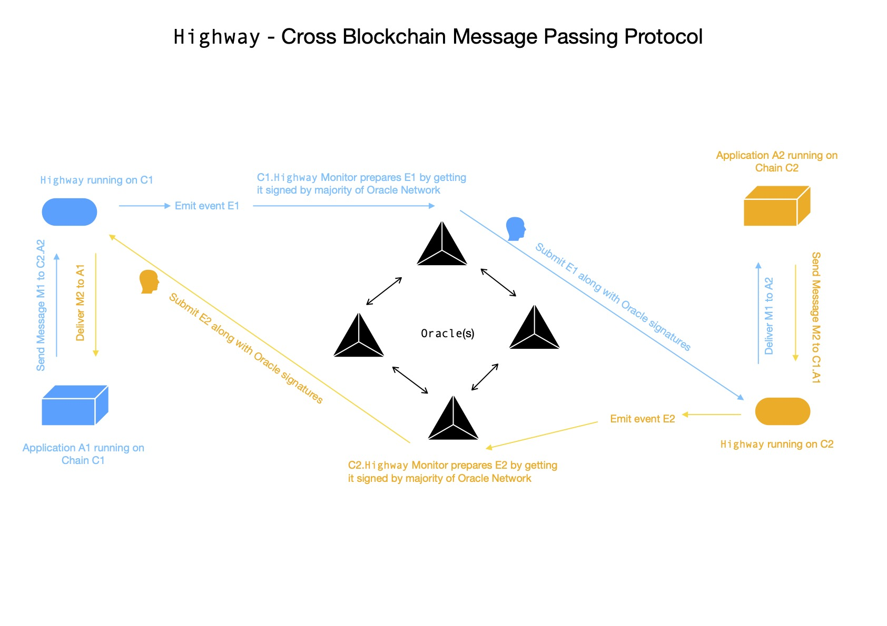

# highway
Cross Blockchain Message Passing Protocol



## Motivation

We're living in a time when new blockchain(s) popping up every single day, due to ease of accessibility to framework(s) for creating chains. We've our assets now distributed across all those self-sovereign chains, each using some mechanism for reaching consensus. Some times these assets are not desired to be kept confined on a single chain rather they're intended to be moving across several chains seamlessly.

This project is an attempt in creating a generic protocol for passing arbitrary messages in between applications running on two different chains. Their state can now be shared across multiple chains. I'll propose one design so that dApps running on different chains can talk to their peers over a reliable, (un-)ordered, authenticated, trustless _( **cause the lesser the better** )_ channel.

> One thing I'd like to clear, this project doesn't think any chain as **root chain ( i.e. L1 ) / child chain ( i.e. L2 )**, rather every participating chain is considered to be operating independently.

---

Broadly speaking, we need two components for reliably passing messages between two applications running on two different chains.

- OnChain Entity
- OffChain Entity

Let's expand on each of these.

### OnChain Entity

Let's say application **A1**, **A2** running on chain **C1**, **C2** respectively, wants to talk to each other, below is a proposed flow.

---

**A1** invokes `send(uint chainId, address app, byte[] message)` method of `Highway` dApp deployed on **C1**, as an effect of user triggered tx **T1**, which will result into emission of event log of below form

```js
Message(uint sourceChainId, address sourceApp, uint targetChainId, address targetApp, uint nonce, bytes[] message)
```

We also assume, in block **B1** of chain **C1**, tx **T1** is included. How this event log will be captured by **OFFCHAIN** entity, we'll see that in sometime.

For emitting event of aforementioned form, we need to hold some state in `Highway` on **C1**.

> Think of `Highway` on **C1** as a gateway to send message to outer world, where some outer world entity will pick it up, get it signed by majority of oracle network & send it to recipient chain's `Highway`, which will in turn attempt to verify it.

For each dApp, on any possible chain _( != **C1** )_, to which any application on **C1** might ever want to send message, we're keeping some state using following data structure


```js
function send(uint chainId, address app, byte[] message) {

    // -- book keeping, starts
    var sourceChainId = getChainId() // C1's built-in function
    var sourceApp = getSenderAddress() // C1's built-in function
    var targetChainId = chainId
    var targetApp = app
    var nonce = ... // figure it out from state keeper nested associative array
    // -- book keeping done

    emit Message(sourceChainId, sourceApp, targetChainId, targetApp, nonce, message) // voila 🎉

}
```

---

ℹ️ For now, let's assume a program will pick event log from **C1** _( which has interest in passing this message cross chain )_ & get it signed by majority of oracle network participants. 

_They will only sign message, after verifying occurance of event **E1** in transaction **T1** included in block **B1** on chain **C1**._ 

As long as majority of these oracle network participants are honest & proposal is correct, it'll be signed. `Highway` on **C2** only consumes message, if it finds majority of valid signatures from decentralised oracle network & it's already aware of who're actual participants of oracle network.

> `Highway` doesn't process same message > 1 times, by checking respective message nonce.

---

Let's now step-by-step go through what happens, when `Highway` on **C2** receives message sent by **A1** of **C1**, in form

```js
function receive(uint sourceChainId, address sourceApp, uint targetChainId, address targetApp, uint nonce, byte[] message, byte[][] sigs) {

    // ...

}
```

For verifying signatures, it'll first need to construct message which was signed by oracle network.

```js
var oracles = []address // Oracle Network Participant Addresses

function receive(...) {
    var message = serialize({
        sourceChainId,
        sourceApp,
        targetChainId,
        targetApp,
        nonce,
        message
    }) // C2's built-in function for serializing object into byte array
    var hashedMessage = hash(message) // C2's built-in function

    var sigCount = 0 // how many are signed by registered oracles
    for(var i = 0; i < len(sigs); i++) {

        var signed = sigs[i]
        if(getSigner(hashedMessage, signed) in oracles) {
            sigCount++
        }

    }

    if(sigCount <= len(oracles) / 2) {
        // > 50% signature verification didn't pass
        return
    }
    // proceed
}
```

> `serialize(...)` is same as what's used by oracle network for serializing parts & signing. **❗️ If not, signature verification won't work. ❗️**

> `hash(...)` is a commonly agreed upon function being used by system for converting large message slice into 32-byte array, which is signed by **Oracle Network**. Primarily I'm using `keccak256`.

It's obvious that receiving side also should keep some state for checking orderliness of messages received from sender. It'll also prevent it from consuming same message twice.

Proposed data structure looks like


If orderliness is tested to be passing, `C2.Highway` will invoke `onReceive` method of **A2** running on **C2**.

```js
function onReceive(uint chainId, address app, byte[] message) {

    // ...
    // A2 ( on C2 ) can now process this message from A1 ( on C1 )
    //
    // These messages are received in ordered, authenticated, verified form

}
```

---

### OffChain Entity

Now we'll define specification for how events emitted by **A1** running on **C1** are caught by **OFFCHAIN** entities & reliably sent to `Highway.receive(...)` running on **C2**, which eventually passes it to **A2**.

---

When a new `Message(...)` event is seen to be emitted from **C1.Highway** one designated program picks it up, which itself is part of Oracle Network, & proposes it to Oracle Network participants for getting it signed. Oracle Network's each participant take independent decision by querying chain **C1**'s transaction **T1** included in block **B1** & checking whether event **E1** is present or not.

If found positive, they'll sign `keccak256`-ed serialised ( yes, deterministic ) form of event **E1** with their private key & publish it to their peers over p2p network. Proposer collects majority of signatures & goes for submitting message, by passing transaction **T2** on chain **C2**.

---

**⭐️ Now I'm going to propose two models**

- Push Model [ **Ordered Channel** ]
- Pull Model [ **Unordered Channel** ]

Let's talk more about them to understand how are they important for our protocol.

#### Push Model

Till now we've event **E1**'s `keccak256`-ed serialised form signed by majority of Oracle Network participants. Also assuming targetChain i.e. **C2** doesn't have issue of high transaction cost, in that case, **OFFCHAIN** entity which picked event **E1** & got signed by Oracle Network participant, can go on & submit transaction **T2** on chain **C2**.

I call this model **PUSH**-ing.

#### Pull Model

Now assume, target chain **C2** has high transaction cost issue, then it might be a good choice to let user's perform their transaction **T2** on chain **C2**. In this case **OFFCHAIN** entity collects event **E1** from chain **C1** & get it signed by majority of Oracle Network participants. Signed messages & original one is kept in a publicly accessible queue, from where user **U1** can pick it up & submit transaction **T2**. This way you let user carry their charge of cross-chain message passing.

I call this model **PULL**-ing, because user pulls & submits tx.

---

We've to make a small change in our orderliness keeper data structure on `Highway` i.e. we're making a distinction between two kinds of channels.

In **Push Model** all messages passed from **C1 -> C2** are passed in ordered manner by **OFFCHAIN** entity, which is why **Push Model** uses preferably ordered channel.

But in **Pull Model** users can just send transaction **T2** on chain **C2** with message of their interest. What it essentially results into message with nonce **1** might arrive before nonce with **0** comes to `C2.Highway`. In that case `C2.Highway` should drop that message, if it's ordered channel. But if we bring unordered channel into picture, we can allow this kind of message passing.

> Note, none of Ordered/ Unordered channel processes message with same nonce twice.

Structure for keeping message consumption information of unordered channel looks like


---

Whenever a channel is created between application **A1** of chain **C1** & application **A2** of chain **C2**, it needs to be registered with `Highway` application running on respective chains. This will be required when receiving message from other side, for determining _does `Highway` need to respect orderly consumption of messages or it can just accept messages in any order_.

I propose one method on `Highway` on-chain application, which will be used for registering channel between applications.

```js
function registerChannel(address localApp, uint remoteChainId, address remoteApp, bool ordered) {}
```

Invoking this method chain **C1**, helps `C1.Highway` to decide whether it's supposed to be respecting orderliness of messages from **C2.A2**. Same method needs to be invoked on **C2**, for letting `C2.Highway` know what should it do when it sees any message coming from **C1.A1** i.e. does it orderly processes them or let them get marked arbitrarily by nonce to just avoid > 1 time consumption.

If `Highway` on any chain doesn't find any entry for preferred mode of operation of channel, it must reject those messages.

Preferred mode of operation needs to be kept on-chain in structure looking like


> **Specification writing in progress**
