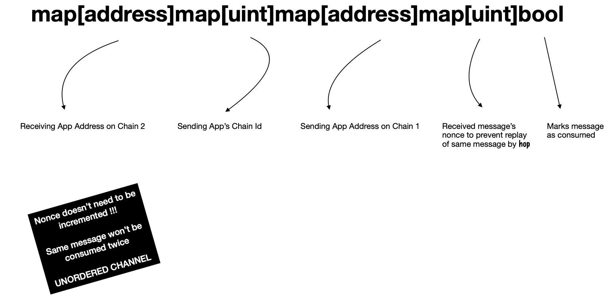

# highway
Cross Blockchain Message Passing Protocol


## Motivation

We're living in a time when new blockchain(s) popping up every single day, due to ease of accessibility to framework(s) for easily creating chains. We've our assets now distributed across all those self-sovereign chains, each using some mechanism for reaching consensus. Some times these assets are not desired to be kept confined on a single chain rather they're intended to be moving across several chains seamlessly.

This project is an attempt in creating a generic protocol for passing arbitrary messages in between applications running on two different chains. Their state can now be shared across multiple chains. I'll propose one design so that dApps running on different chains can talk to their peers over a reliable, (un-)ordered, authenticated, trustless _( **cause the lesser the better** )_ channel.

> One thing I'd like to clear, this project doesn't think any chain as **root chain ( i.e. L1 ) / child chain ( i.e. L2 )**, rather every participating chain is considered to be operating independently.

---

We need two components for reliably passing messages between two applications running on two different chains.

- OnChain Entity
- OffChain Entity

Let's expand on each of these.

### OnChain Entity

Let's say application **A1**, **A2** running on chain **C1**, **C2** respectively, wants to talk to each other, below is a proposed flow.

---

**A1** invokes `send(uint chainId, address app, byte[] message, address hop)` method of `Highway` dApp deployed on **C1**, as an effect of user triggered tx **T1**, which will result into emission of event log of below form

```js
Message(uint sourceChainId, address sourceApp, address hop, uint targetChainId, address targetApp, uint nonce, bytes[] message)
```

We asume, in block **B1** of chain **C1**, tx **T1** is included. How this event log will be captured by **OFFCHAIN** entity i.e. `hop`, we'll see that in sometime.

For emitting event of aforementioned form, we need to hold some state in `Highway` on **C1**.

> Think of `Highway` on **C1** as a gateway to send message to outer world, where some outer world entity i.e. `hop` will pick it up & send it to recipient chain's `Highway`, which will in turn attempt to verify it.

For each dApp, on any possible chain _( != **C1** )_, to which any application on **C1** might ever want to send message, we're keeping some state using following data structure


```js
function send(uint chainId, address app, byte[] message, address hop) {

    // -- book keeping, starts
    var sourceChainId = getChainId() // C1's built-in function
    var sourceApp = getSenderAddress() // C1's built-in function
    var targetChainId = chainId
    var targetApp = app
    var nonce = ... // figure it out from state keeper nested associative array
    // -- book keeping done

    emit Message(sourceChainId, sourceApp, hop, targetChainId, targetApp, nonce, message) // voila 🎉

}
```

---

ℹ️ We've one imaginary **OFFCHAIN** entity for picking events emitted from `Highway` running on **C1** & reliably passing it to `Highway` running on **C2**, which is nothing but **hop**. How exactly these **OFFCHAIN** entities work, is a blackbox to us, as of now. We'll work on their specification, once we're done with **ONCHAIN** entities.

For now, let's assume `hop` can be either an automated program/ real-user who will pick event log from **C1** & invoke `Highway`'s `receive` function on **C2**, after getting it signed by `Highway`'s trusted oracle. This oracle is an **OFFCHAIN** entity, which will only sign message to be passed, after verifying occurance of event on **C1**. `Highway` on **C2** only processes message, if it finds valid signature from its oracle, on a correctly ordered message.

> It doesn't process same message more than once, by checking respective nonce of message.

---

Let's now step-by-step go through what happens, when `Highway` on **C2** receives message sent by **A1** of **C1**, in form

```js
function receive(uint sourceChainId, address sourceApp, address hop, uint targetChainId, address targetApp, uint nonce, byte[] message, byte[] signed) {

    // ...

}
```

First it'll check whether it's `hop` who has invoked method or not

```js
function receive(...) {
    var invoker = getSenderAddress() // C2's built-in function
    if invoker != hop {
        // only hop should do it
        return
    }
    // proceed
}
```

Now it'll verify signature, to check whether its oracle has signed received message or not. For doing so, it'll first construct message which was signed by oracle.

```js
var oracle = 0x<addr> // Truested party for gateway contract

function receive(...) {
    var message = serialize({
        sourceChainId,
        sourceApp,
        hop,
        targetChainId,
        targetApp,
        nonce,
        message
    }) // C2's built-in function for serializing object into byte array
    var hashedMessage = hash(message) // C2's built-in function

    if getSigner(hashedMessage, signed) != oracle {
        // signature verification didn't pass
        return
    }
    // proceed
}
```

> `serialize(...)` is same as what's used by **C2**'s oracle for serializing parts & signing message. **❗️ If not, signature verification won't work. ❗️**

> `hash(...)` is a commonly agreed upon function being used by system for converting large message slice into 32-byte array, which is signed by **Oracle**. Primarily I'm using `keccak256`.

It's obvious that receiving side also should keep some state for checking orderliness of messages received from sender.

Proposed data structure looks like


If orderliness is tested to be passing, `Highway` will invoke `onReceive` method of **A2** running on **C2**.

```js
function onReceive(uint chainId, address app, address hop, byte[] message) {

    // ...
    // A2 ( on C2 ) can now process this message from A1 ( on C1 )
    //
    // These messages are received in ordered, authenticated, verified form

}
```

---

## OffChain Entity

Now we'll define specification for how events emitted by **A1** running on **C1** are caught by **OFFCHAIN** entities & reliably sent to `Highway.receive(...)` running on **C2**, which eventually passes it to **A2**.

---

You might have already seen field `hop` in `Highway.send(...)` method, which is the address of party designated to do following steps

- Pick this event from tx **T1** included in block **B1** of chain **C1**
- Send this message to `C2.Highway`'s trusted oracle, to verify & sign it
    - `C2.Highway`'s oracle is one **OFFCHAIN** entity trusted by `C2.Highway`, for verifying inclusion of tx **T1** in block **B1** of chain **C1**, while also checking _metadata & content_ of message being sent cross-chain, before signing it
- Signed message & original message is sent to `C2.Highway`'s `receive()` method

**⭐️ Now I'm going to propose two models**


- Push Model [ **Ordered Channel** ]
- Pull Model [ **Unordered Channel** ]

Let's talk more about them to understand how are they important for our protocol.

---

### Push Model

When **A1** running on **C1** attempted to send message to outer world, **OFFCHAIN** entity continuously monitoring `C1.Highway`'s event log can pick it up & send it to `C2.Highway`'s trusted oracle for verification & signing. After it's done, it'll invoke `C2.Highway.receive(...)` & get message processed.

I call it **PUSH** based, because **OFFCHAIN** entity has kind of an aggressive tendency of delivering messages between chains. This is an acceptable scenario when **C2** is a chain which has low tx cost.

### Pull Model

You might have already guessed what it's going to be. 

This time `hop` may not be an automated aggressive program, rather it's someone who is in need of transferring that message from **C1 -> C2**.

Let's take an example. Say, **C1** is so-called L2-chain & **C2** is Ethereum Network. **A1**'s user **U1** has an interest of transferring some asset it owns to **A2** counterpart of dApp _( distributed across chains )_.

So **A1** invokes `C1.Highway.send()` with `hop` address set to `U1` & let `U1` do all aforementioned steps for successfully passing message to **A2** on **C2** i.e. Ethereum Network.

I call it **PULL** based mechanism, because here `U1` plays role of **OFFCHAIN** entity, by pulling message(s) of its interest & passing it to `C2.Highway.receive(...)`.

This is a suitable model, when you might not want to pay high tx cost of **C2**.

---

**Modification**

Now after this point you may have understood we've a flaw in our state keeper data structure on `C2.Highway`, because it only allows delivery of messages in ordered form.

For letting users pick their message of interest from **C1** & send it to **C2**, I'm going to propose a different data structure, where we're going to mark which `nonce` message is consumed on **C2** & which are not yet.

> Please note, in last data structure diagram ( 👆 ), we used to keep last processed message's `nonce` & increment for next expected message. But this is not acceptable for **unordered channel**.



> **Specification writing in progress**
